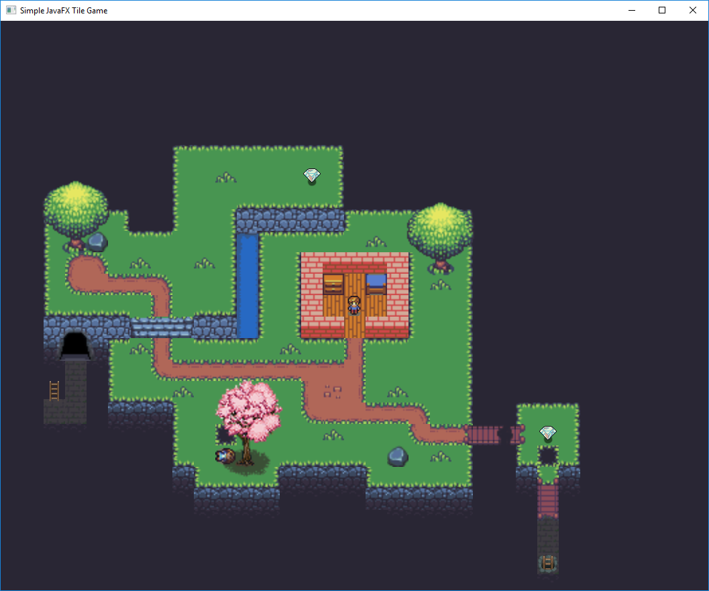
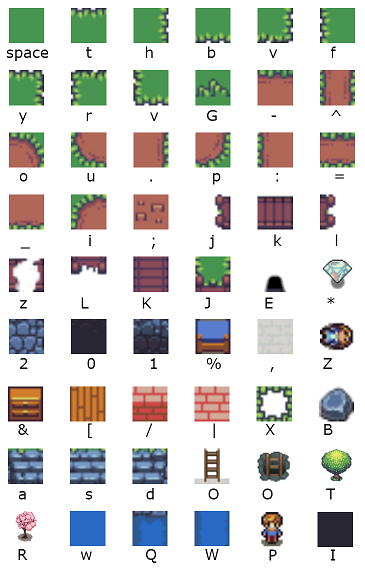

# Ariel-or-Dead-Fish

Ariel or Dead Fish is a simple 2D game made in JavaFX. It was an exercise at school for learning about object oriented programming. The code is quite bad and weird, partly due to having lost the original source code. Had to actually [decompile](http://www.javadecompilers.com/) it from the JAR-file I had laying around.

Here is an image of how the game looks:



Custom levels can be made in any text editor using the following symbols:



The text file for the level from above looks like this:

```
IIIIIIIIIIIIIIIIIIIIIIIIIIIIIII
IIIIIIIIIIIIIIIIIIIIIIIIIIIIIII
IIIIIIIIIIIIIIIIIIIIIIIIIIIIIII
IIIIIIIIIIIIIIIIIIIIIIIIIIIIIII
IIIIIIIIIIIIIIIIIIIIIIIIIIIIIII
IIIIIIIIIIIIIIIIIIIIIIIIIIIIIII
IIIIIIIrttttttyIIIIIIIIIIIIIIII
IIIIIIIf G   *hIIIIIIIIIIIIIIII
IIIIIIIf  bbbbnIIIIIIIIIIIIIIII
IrttyIIf h22222rttttyIIIIIIIIII
IfTB tt  hQrttt G * hIIIIIIIIII
Ifio G  GhWfh|///|fThIIIIIIIIII
Ifu_==o  hWfh|&[%|fGhIIIIIIIIII
Ivbbb ^ bnWfh|[P[|f hIIIIIIIIII
I2222asd22Wfh//[//f hIIIIIIIIII
I1E1rG^ ttt Gtt^tt  hIIIIIIIIII
I0,0f u======--.    hIIIIIIIIII
IO,IvbbG     :;. G  hIIIIIIIIII
I,,I111f     u__==o hIIrtyIIIII
I00I000f X    G   u=jkzl*hIIIII
IIIIIIIv ZR bbbb B GhIIvXnIIIII
IIIIIII1vbbn1111vbbbnII1J1IIIII
IIIIIII01111000011111II0K0IIIII
IIIIIIII0000IIIII0000IIILIIIIII
IIIIIIIIIIIIIIIIIIIIIIII,IIIIII
IIIIIIIIIIIIIIIIIIIIIIIIOIIIIII
IIIIIIIIIIIIIIIIIIIIIIII0IIIIII
```